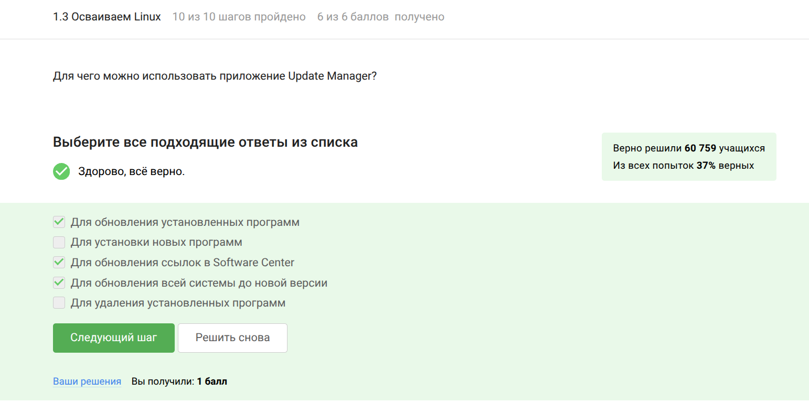
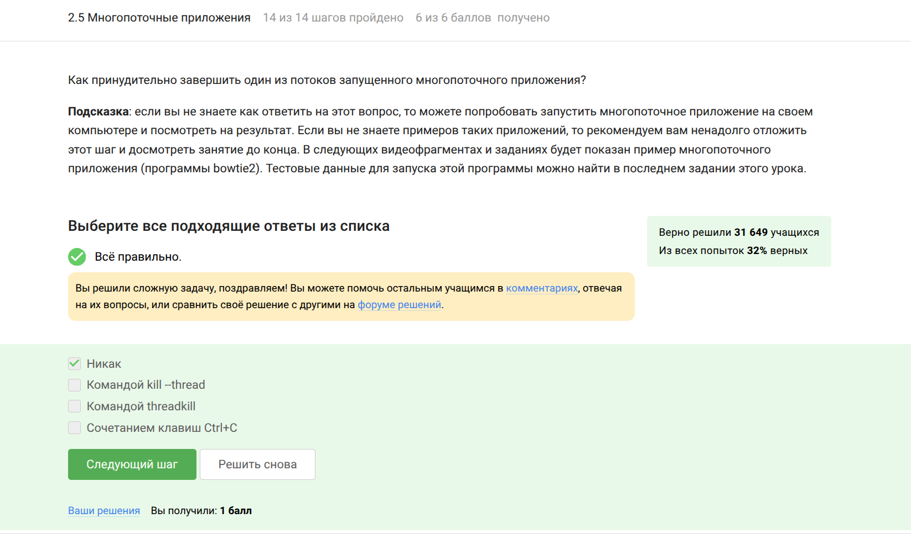
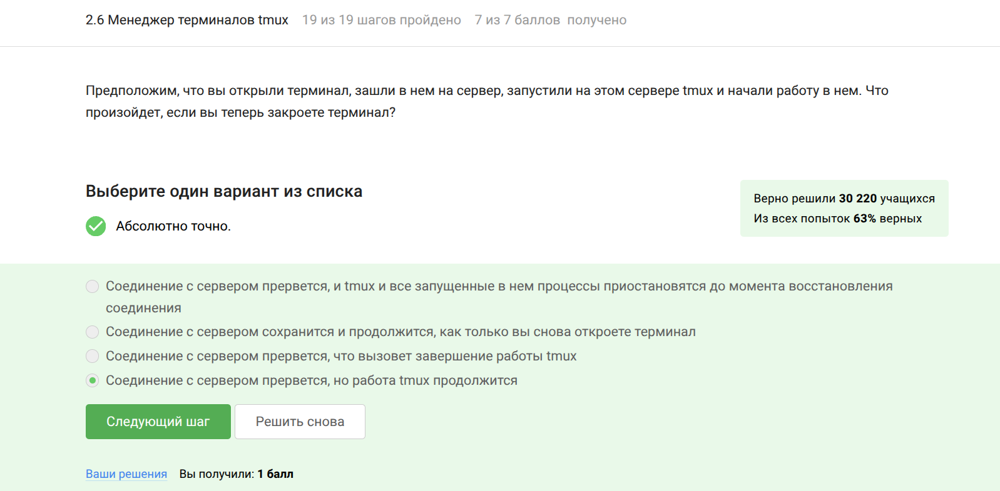
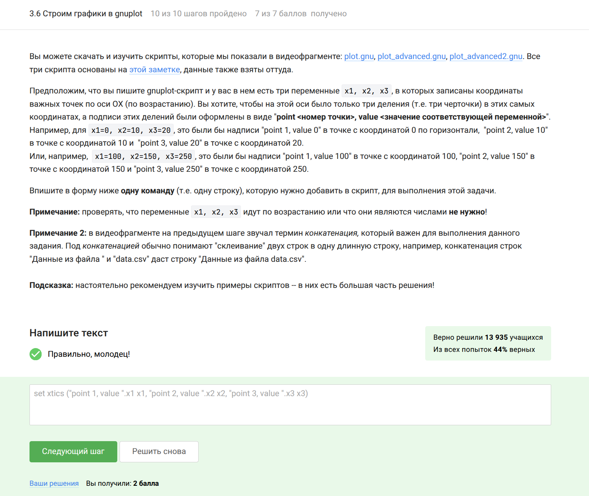

<picture align="center">
  
</picture>

# Прохождение внешнего курса на Stepik ("Введение в Linux")

| | |
| --- | --- |
| Rutube-канал | [[Rutube](https://rutube.ru/channel/58455781/)] |
| Канал Plvideo | [[plvideo](https://plvideo.ru/channel/lRb1n7bNbXsH)] |
| Прохождение на github | [[GitHub](https://github.com/shakiragas/study_2024-2025_os-intro/tree/master/stepik)] |
| Ссылка на сертификат | [[Stepik](https://stepik.org/cert/2845908)] |

# Цель 

Познакомиться с операционной системой Linux и её базовыми возможностями.

# Задания

1. Общая информация о курсе
2. Как установить Linux
3. Освоение linux
4. Основы терминала
5. Запуск исполняемых файлов
6. Ввод/вывод
7. Скачивание файлов с интернета
8. Работа с архивами
9. Поиск файлов и слов в файлах
10. Знакомство с сервером
11. Обмен файлами
12. Запуск приложений
13. Контроль запускаемых программ
14. Многопоточные приложения
15. Менеджер треминалов tmux
16. Расширенное руководство по установке Linux
17. Текстовый редактор vim
18. Скрипты на bash: основы
19. Скрипты на bash: ветвления и циклы
20. Скрипты на bash: разное
21. Продвинутый поиск и редактирование
22. Построение графиков в gnuplot
23. Разное

# Этап 1

**Я изучила общаю информацию о курсе и ответила на вопросы:**

**Изучила про способ установки Linux и ответила на вопросы:**

**Изучила освоение Linux и выполнила задания:**

**Изучила основы терминала и выполнила задания:**

**Изучила запуск исполняемых файлов и выполнила задания:**

**Изучила ввод/вывод и ответила на вопросы:**

**Изучила скачивание файлов с интернета и выполнила задания:**

**Изучила работу с архивами и ответила на вопросы:**

**Изучила поиск файлов и слов в файлах и выполнила задания:**

# Этап 2

**Я познакомилась с сервером и ответила на тестовые вопросы:**

**Рассмотрела обмен файлами и ответила на тестовые вопросы:**

**Познакомилась с запуском приложений и ответила на тестовые вопросы:**

**Познакомилась с контролем запускаемых программ и ответила на тестовые вопросы:**

**Познакомилась с многопоточными приложениями и выполнила задания:**

**Познакомилась с менеджером треминалов tmux и выполнила задания:**

# Этап 3

**Я познакомилась с текстовыйм редактором vim и ответила на тестовые вопросы:**

**Познакомилась с основами скриптов bash и ответила на тестовые вопросы:**

**Познакомилась с ветвлениями и циклами скриптов на bash и ответила на тестовые вопросы:**

**Изучила дополнительные возможности со скриптами bash и выполнила задания:**

**Изучила продвинутый поиск и редактирование, решила несколько заданий:**

**Изучила построение графиков в gnuplot и решила задания:**

**Изучила разное (дополнительные задания) и ответила на вопросы:**

# Итог

Я прошла курс и получила сертификат с отличием:

# Выводы

При прохождении курса я познакомилась с операционной системой Linux и её базовыми возможностями.

# Список литературы

1. http://lib.ru/LINUXGUIDE/torvalds_jast_for_fun.txt
2. https://ubuntu.com/
3. https://ubuntu.com/tutorials/install-ubuntu-desktop#1-overview
4. http://rus-linux.net/
